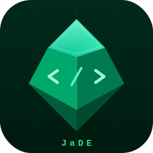

# JaDE — Java Development Environment

A lightweight Java IDE built with Electron and Monaco Editor, powered by eclipse.jdt.ls for language intelligence.



## Features

- Syntax highlighting and code completion via Monaco Editor
- Full LSP integration (eclipse.jdt.ls)
  - Go to Definition (F3)
  - Go to Implementation (Cmd+T)
  - Find Usages (Cmd+Shift+G)
  - Hover documentation
  - Error / warning diagnostics
- Navigate back / forward (Cmd+[ / Cmd+])
- Open Type dialog — fuzzy search Java types (Cmd+Shift+T)
- Open Resource dialog — fuzzy search .java files (Cmd+Shift+R)
- Multi-root workspace support
- Workspace persistence — reopens last workspace automatically
- File tree explorer with sidebar resize
- Tab bar with close buttons
- Library source viewing via jdt.ls; CFR decompiler fallback
- Manual workspace re-index (File → Refresh Workspace, Cmd+Shift+F5)

## Requirements

- Node.js 18+
- Java 17+ (for running jdt.ls)
- [jdtls](https://github.com/eclipse-jdtls/eclipse.jdt.ls) installed via Homebrew
- [CFR decompiler](https://github.com/leibnitz27/cfr) JAR (optional, for decompiled library source fallback)

## Setup

### 1. Clone and install dependencies

```bash
git clone <repo-url>
cd java-editor
npm install
```

### 2. Install jdtls via Homebrew

```bash
brew install jdtls
```

JaDE will automatically locate jdtls at `/opt/homebrew/share/jdtls` (Apple Silicon) or `/usr/local/share/jdtls` (Intel).

### 3. Install CFR decompiler (optional)

CFR is used as a fallback to decompile library `.class` files when no sources JAR is attached. Without it, navigating into library classes will show an error message instead of decompiled source.

Download [cfr-0.152.jar](https://github.com/leibnitz27/cfr/releases) and place it at:

```
tools/cfr.jar
```

```bash
mkdir -p tools
curl -L https://github.com/leibnitz27/cfr/releases/download/0.152/cfr-0.152.jar -o tools/cfr.jar
```

### 4. Run in development mode

```bash
# Open a project folder
npm start -- --folder /path/to/maven/project

# Open a project and specific files
npm start -- --folder /path/to/project --files src/main/java/com/example/Main.java

# No args — restores last workspace
npm start
```

## Build (macOS)

Produces a signed DMG using electron-builder. Requires jdtls to be installed via brew on the target machine — it is not bundled.

```bash
npm run dist
# Output: dist-build/JaDE-0.1.0-arm64.dmg
```

Open the DMG, drag JaDE to `/Applications`.

## Project structure

```
main/
  index.js        — Electron main process, LSP lifecycle, IPC handlers
  lsp-client.js   — JSON-RPC LSP client (stdio framing)
  file-watcher.js — chokidar watcher, debounced didChangeWatchedFiles
  preload.js      — contextBridge IPC surface

renderer/
  index.html      — App shell
  editor.js       — Monaco editor, keybindings, dialogs, navigation
  filetree.js     — File tree sidebar
  tabs.js         — Tab bar
  styles.css      — All styles

build/
  icon.svg        — App icon source
  icon.icns       — macOS app icon (generated)

tools/            — Not committed; place cfr.jar here
jdtls/            — Not committed; use brew install jdtls
```

## Keybindings

| Key | Action |
|-----|--------|
| F3 | Go to Definition |
| Cmd+T | Go to Implementation |
| Cmd+Shift+G | Find Usages |
| Cmd+Shift+T | Open Type (fuzzy class search) |
| Cmd+Shift+R | Open Resource (fuzzy file search) |
| Cmd+[ | Navigate back |
| Cmd+] | Navigate forward |
| Cmd+Shift+O | Open Folder |
| Cmd+O | Open File |
| Cmd+Shift+F5 | Refresh Workspace (re-index) |

## Workspace data

jdt.ls workspace indexes are stored in:
```
~/Library/Application Support/JaDE/jdtls-workspaces/
```

The active workspace folders are persisted to:
```
~/Library/Application Support/JaDE/workspace.json
```

Delete these to force a clean re-index.
